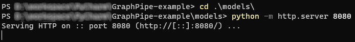
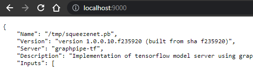

# GraphPipe-example
Simple GraphPipe usage example for tensorflow model.
Prepared on the basis of documentation: 
<https://oracle.github.io/graphpipe/#/guide/user-guide/overview>

> Simple quick start is here:
> <https://oracle.github.io/graphpipe/#/guide/user-guide/quickstart>

## How to run GraphPipe via docker - simple example
1) Get model from quick start example (see above) and save it on [models](./models)/squeezenet.pb
```commandline
curl https://oracle.github.io/graphpipe/models/squeezenet.pb > squeezenet.pb
```
> It could be use custom pb model.

2) Download GraphPipe docker image (in this example is cpu version: <https://oracle.github.io/graphpipe/#/guide/servers/installation>)
 ```commandline
docker pull sleepsonthefloor/graphpipe-tf:cpu
```

3) Now we have two way to run docker GraphPipe container:
   1) Running docker container with local model.
   ```commandline
   docker run -it --rm -v <path to model>:/tmp/ -p 9000:9000 sleepsonthefloor/graphpipe-tf:cpu --model=/tmp/squeezenet.pb --listen=0.0.0.0:9000
   ```
   > In this case, we need to use a volume mount in order to serve local models: ... -v <termina path>:<container path>
   2) Running docker container with remote model (via http).
      1) Go into [models](./models) and run python simple http server (in this example run on 8080 port)
      > Model can share in other repository (e.g. bitbucket or github)
      ```commandline
      cd model
      python -m http.server 8080
      ```
      then you'll see:
   
      
      
      2) Running docker container:
      ```commandline
      docker run -it --rm -p 9000:9000 sleepsonthefloor/graphpipe-tf:cpu --model=https://loclhost:8080/squeezenet.pb --listen=0.0.0.0:9000
      ```

4) Testing server:
Run on web browser local address on port 9000:

>http://localhost:9000


## How to use GraphPipe - simple example
1) Install packages from requirements.txt
```commandline
pip install -r requirements.txt
```
2) Run script [request_example.py](request_example.py)
> Script use classification to all images in [/test_data](./test_data)
>
> Obtained results:
> 
> *For test_data\g1.png classification is: [546] electric guitar*
> 
>
> *For test_data\g2.png classification is: [546] electric guitar*
> 
> 
> *For test_data\g3.png classification is: [402] acoustic guitar*
> 
